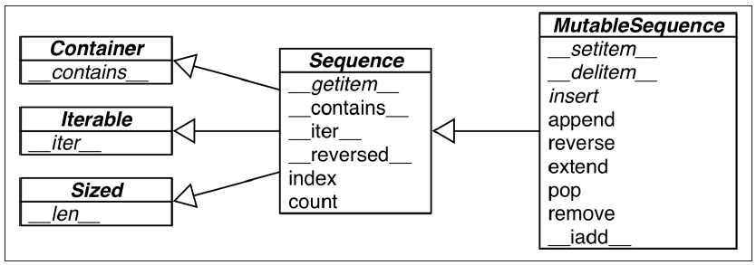

Title: Notes on the book Fluent Python
Date: 20161104
tags: python

I'm just writing my understanding, or copying & pasting some segments from the book if those sentences are brief and meaningful themselves. 

* __What is the so-called "Python data model"?__

	It's the way how python organizes data into objects. There're actually two ways for python to organize data, one is called "types and objects". Here's [an excellent material](http://www.cafepy.com/article/python_types_and_objects/python_types_and_objects.html) about this topic. 
	
	In words, we can view there are 3 layers of objects that can be defined in python, called metaclass, class and "instances". Actually they are all objects. All classes (except a special one), including metaclasses, have a common root base class, which is the class `object`, standing at the top of the second layer. The class `object` is the only one class that have no base classes, representing by the built-in attribute `.__bases__`.  
	
	Each objects in python has its own mother, who instantiates it. This mother object is recorded in the built-in attribute `.__class__`. Therefore all objects have non-empty `.__class__` attribute. Here comes a problem, who's the root mother, and the mother of this root? Python solve this problem by setting the root mother `type` pointing itself, namely `type.__class__ is type` results in a `True`. `type`, as a class, is actually a metaclass, which instantiate all classes by default. It's the only one default metaclass pre-defined in python. Now we have a interesting loop: `type` is an instance of itself, `type` as a class is a subclass of `object`, so `type` is an instance of `object`; on the other hand, `object` as a class is instantiated by the metaclass `type`, so `object` is an instance of `type`.  

	Notice that the class/metaclass `type` is a pre-defined object in python, it's not the one in the phrase "types and objects". For "types and objects", this "type" denotes "class", they are two equivalent concepts. A non-meta-class can instantiate objects, here we use the word "instances". Those instances are not allowed to further instantiate objects. That's why there're only 3 layers of objects: the root metaclass `type` creates itself (by definition) and all classes (which in the second layer), classes create instances, which in the last layer. A class is also called a type. There're many pre-defines types in python, such as `list`, `int`, `function`, etc.

	As document says, every object has an identity, a type and a value. Its type, or class, is who creates it, recorded in `.__class__`, and can be retrieved by `type(yourobject)`. 

	One more thing to mention about types: all types(classes) are singletons. You cannot define two identical classes with same names. `type(yourobject)` is actually a class creator, where `type` is not a function but a class name. However the class created (here we can roughly use the word "returned") by this expression is exactly the __one__ who creates `yourobject`.
	
	Another way to organize data is by protocols and interfaces. For example the descriptor protocol is only a protocol, or a set of interfaces, not a type in python. If an object has a method `__get__(self, obj, typ)`, then it can be called a descriptor, which does not mean the type of this object is "descriptor". Likewise, iterator and sequence are both protocols, corresponding to `next()` and `__getitem__()` methods respectively. 

	So in python we have an explicit taxonomy of data, called "types and objects", we can make use of it by subclassing. And also we have an implicit taxonomy, which is the protocol way, we can exploit by implementing the relevant interface methods. For instance we can implement a `__getitem__()` method in order to have all the operations and properties of operator `[]`, which is viewed as a sequence. 

* __Difference between `repr()` and `str()`__

	In short, `repr()` is nearer to the true form of objects, while `str()` is for display to end users. 

		>>> print(repr('1'), repr(1))
		("'1'", '1')
		>>> print(str('1'), str(1))
		('1', '1')
	Usually we want to form the result of `repr()` to be as a constructor, in other words if we run `eval()` with this result as the argument, it will result in a same object. 

* __Tips on sequence (Chapter 2)__

	* Look at this neat diagram. 
	
		
		Here names in _italic_ are abstract classes and abstract methods. 

	* List comprehensions used for Cartesian products
		
			>>> tshirts = [(color, size) for color in colors for size in sizes]

	* Generator expressions
	
		Just replace the brackets in listcomps by parentheses. Instead of lists, generator expressions result in generators.

	* Use the * to grab excess items
	
		This is only available in Python 3. 

			>>> a, b, *rest = range(5)
			>>> a, b, rest
			(0, 1, [2, 3, 4])
			>>> a, *body, c, d = range(5)
    		>>> a, body, c, d
			(0, [1, 2], 3, 4)

	* Tuples are not just immutable lists
	
		They can be used as records, and even named records with `collections.namedtuple`. Use tuple unpacking to shorten your codes. 

	* "Tuple unpacking" is not only for tuples
	
		Unpacking mechanism works with any iterable object. The corresponding byte code is `UNPACK_SEQUENCE`. 

	* Slicing
	
		The `__getitem__` and `__setitem__` special methods that handle the `[]` operator simply receive the indices in `a[i, j]` as a tuple. In other words, to evaluate `a[i, j]`, Python calls `a.__getitem__((i, j))`.
		
		Slicing can also be done in this multidimensional form, for instance `a[m:n, k:l]`. 
		
		NumPy uses `...` as a shortcut when slicing arrays of many dimensions; for example, if `x` is a four-dimensional array, `x[i, ...]` is a shortcut for `x[i, :, :, :,]`.

		The organization of mutable sequences is pretty loose. We can delete or modify a mutable sequence with almost any means:

			>>> l = list(range(10))
			>>> l
			[0, 1, 2, 3, 4, 5, 6, 7, 8, 9]
			>>> l[2:5] = [20, 30]
			>>> l
			[0, 1, 20, 30, 5, 6, 7, 8, 9]
			>>> del l[5:7]
			>>> l
			[0, 1, 20, 30, 5, 8, 9]
			>>> l[3::2] = [11, 22]
			>>> l
			[0, 1, 20, 11, 5, 22, 9]

	* In-place operation
	
		`+=` and `*=` operators are of this kind. In both cases of normal and in-place assignment, it first evaluates the object being assigned, then assigns it to the name. The difference between `a=a+b` and `a+=b` happens in the object. The former one will generate a new object of value `a+b`, while the later will, if possible, operates the objects referred by `a` directly, for instance executes `a.extend(b)`. 

* __How to understand python's tuple__

	Tuple is known as a container type, but in my understanding, we'd better not view it as a traditional "container". People say that a series of items concatenated by commas is actually a tuple, so just view it as with a pair of parentheses. But I'd rather think of any tuples as __without parentheses__. Tuple is not a traditional container, it's only a permutation of items. When you write it down, then it is fixed, because it's the permutation of those items you just wrote. You can access its elements using the `[]` operator because python offers you this simple way to access, this is the special setting of tuple in python. But after all, you cannot assign any value to those items. This is obvious when you think of it as a permutation of fixed items. 

* __About python bytecode and other internals__

	Refer to this [wonderful series of articles](http://akaptur.com/blog/2013/11/15/introduction-to-the-python-interpreter/). There's also an [article](http://akaptur.com/blog/2014/06/11/of-syntax-warnings-and-symbol-tables/) introducing some other internals. Bytecode seems to be quite low-level, but actually it's the opposite. The result highly depends on the low-level implementation. The [4th part](http://akaptur.com/blog/2013/12/03/introduction-to-the-python-interpreter-4/) of that series gives a nice example: 

		>>> def modulus(x, y):
        ...     return x % y
		...
		>>> [ord(b) for b in modulus.func_code.co_code]
		[124, 0, 0, 124, 1, 0, 22, 83]
		>>> dis.dis(modulus.func_code)
		  2           0 LOAD_FAST                0 (x)
		              3 LOAD_FAST                1 (y)
		              6 BINARY_MODULO
		              7 RETURN_VALUE
		>>> modulus(15,4)
		3
		>>> modulus("hello %s", "world")
		'hello world'
	See, the key point is indeed the implementation of `BINARY_MODULO`.

	There's a [deeper article](http://security.coverity.com/blog/2014/Nov/understanding-python-bytecode.html) introducing bytecode from a reverse engineering viewpoint, in which only python binary file (ended with `pyc` or `pyo`) can be accessed. 

* __A Python API convention__

	Functions or methods that change an object in place should return `None` to make it clear to the caller that the object itself was changed, no new object was created. 

	`sorted()` function returns a new sorted iterable, while `list.sort()` is an in-place method. 

* __Binary search: `bisect`__

	Use `bisect` for binary search. `bisect.bisect` for searching, `bisect.insort` for inserting after searching. 
	Here's a smart example in the book, notice that it uses binary search instead of a bunch of `if`, augment the performance and shorten the code. 

		>>> def grade(score, breakpoints=[60, 70, 80, 90], grades='FDCBA'):
        ... 	i = bisect.bisect(breakpoints, score)
        ... 	return grades[i]
        ...
        >>> [grade(score) for score in [33, 99, 77, 70, 89, 90, 100]]
        ['F', 'A', 'C', 'C', 'B', 'A', 'A']

* __The `memoryview` object__

* __Alternatives of `list`__

	There are quite a few data structures can somehow substitute `list`. For example `array.array`, `numpy.narray`, `collections.deque`, and the module `Queue` including several classes for threaded programming and multiprocess programming. 

* __The `key` argument__

	_The `key` optional argument of list.sort, sorted, max, and min is a great idea. Other languages force you to provide a two-argument comparison function like the deprecated `cmp(a, b)` function in Python 2. Using `key` is both simpler and more efficient. It’s simpler because you just define a one-argument function that retrieves or calculates whatever criterion you want to use to sort your objects; this is easier than writing a two-argument function to return –1, 0, 1. It is also more efficient because the `key` function is invoked only once per item, while the two-argument comparison is called every time the sorting algorithm needs to compare two items. Of course, Python also has to compare the keys while sorting, but that comparison is done in optimized C code and not in a Python function that you wrote._

	_By the way, using `key` actually lets us sort a mixed bag of numbers and number-like strings. You just need to decide whether you want to treat all items as integers or strings:_

		>>> l = [28, 14, '28', 5, '9', '1', 0, 6, '23', 19]
		>>> sorted(l, key=int)
		[0, '1', 5, 6, '9', 14, 19, '23', 28, '28']
		>>> sorted(l, key=str)
		[0, '1', 14, 19, '23', 28, '28', 5, 6, '9']

* __Tips on dictionaries and sets (Chapter 3)__

	
